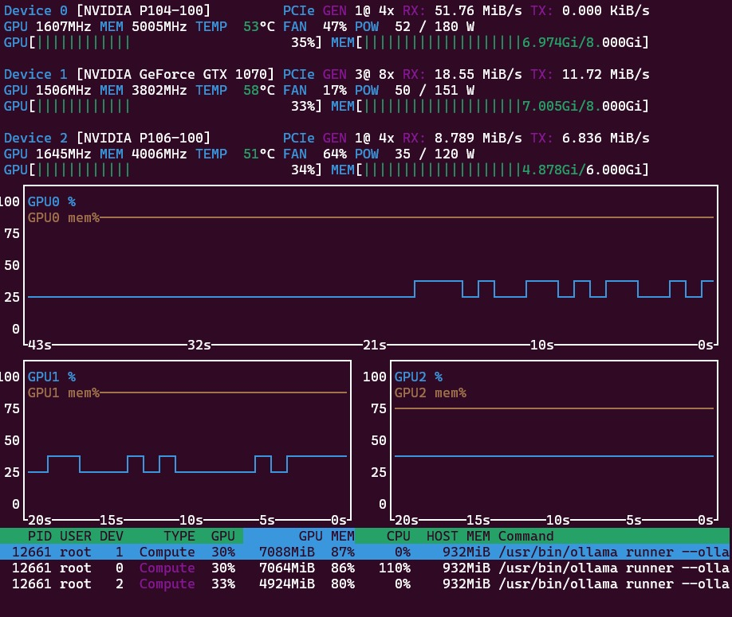

# Welcome to hv.io.vn

A test domain for projects in Hưng Vượng 1 in Thành Phố Hồ Chí Minh. There are a few servers running in our lab. They provide the services listedbelow:

## Triple-GPU server.home

This one is only available internally. With 3 GPUs and a combined VRAM of 22 GB it is good for :

- 19 GB [glm-4.7-flash](https://ollama.com/library/glm-4.7-flash) with MoE and reasoning, 23 token/s on Open WebUI.
- 17 GB [translategemma:27b](https://ollama.com/library/translategemma) for 55 languages, maybe for the [timeline](https://github.com/kreier/timeline) project?
- 20 GB [qwen3-vl:30b vision-language model](https://ollama.com/library/qwen3-vl) in the Qwen family, for texts in images on WebUI?

### Subdomains:

- [llm.server.home](http://llm.server.home) The Open WebUI interface for the LLMs hosted on the server.
- [grafana.server.home](http://grafana.server.home) Visualize the utilization of the server. I would like a combination of btop and nvtop.
- [wp.server.home](http://wp.server.home) A small test installation of wordpress to test features.

I would like an output like this:

## Raspberry Pi4 at pi4.hv.io.vn

Apart from the main domain [pi4.hv.io.vn](https://pi4.hv.io.vn) it also has some services at a subdomain

### Tiny Chat interface

Under [llm.pi4.hv.io.vn](https://llm.pi4.hv.io.vn) I installed OpenWebUI to access a local ollama installation.

### Grafana

This is just to visualize how much this 4GB tiny server is utilized.

### Wordpress

Even a little wordpress installation is possible and can be accessed on [wp.pi4.hv.io.vn](https://wp.pi4.hv.io.vn). Being local it is actually really fast, compared to servers in a datacenter in Germany. Like for [saiht.de/blog](https://saiht.de/blog).

### Pihole network filter [pi4.hv.io.vn/admin](https://pi4.hv.io.vn/admin)

I didn't know how much a browser connects to ad servers until I installed this one. The first days some 25% of all DNS traffic is related to ads and has to be blocked! What a blessing. Configuration and statistics at [pi4.hv.io.vn/admin](https://pi4.hv.io.vn/admin). Please don't ask me about this configuration - it took 12 hours with AI coding assistant to get this working!

A side effect is that it is also a DNS server. So I can use it for different services inside the network to be mapped to easy-to-remember domain names. Like llm.server.home without having to change the `hosts` table on each client computer in my network. Very handy!
